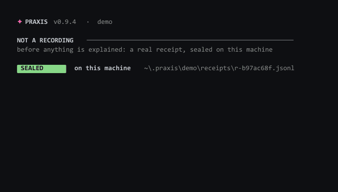
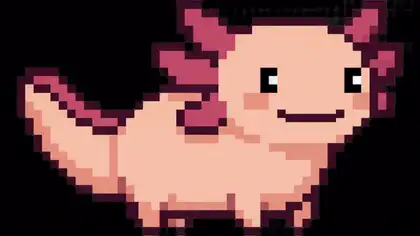

<div align="center">


# PRAXIS

### Your AI says "done." PRAXIS proves it.

**Praxis is the open-source trust layer for AI-written code.** Every session leaves a
sealed, tamper-evident **receipt** of what the AI *actually did* — and an independent
judge rules each of its claims **TRUE / FALSE / UNVERIFIABLE** against that evidence.
It also gives your AI a durable **memory**: every session distilled into one markdown
file, handed back automatically next time, so you never re-explain your project.

[](https://www.npmjs.com/package/praxis-memory)
[](LICENSE)
[](https://nodejs.org)
[](#safety)

**[Website](https://vaishak-v-nair.github.io/PRAXIS/)** · **[Changelog](CHANGELOG.md)** · **[Receipt spec](RECEIPT-SPEC.md)** · **[Start here (no terminal experience)](docs/START-HERE.md)**

```bash
npx praxis-memory
```

*One command — same on **Windows, macOS and Linux** (Node 22+). It sets up the hooks, the memory file, the tray companion, everything — then every session after remembers. No global install needed: the hooks (auto-capture, pre-compact snapshots, tray auto-start) run through `npx`, so they work from day one. Prefer the short `praxis` command? Optional: `npm install -g praxis-memory` — every command below then drops the `npx praxis-memory` prefix.*

**Want to see it before you install anything?**

```bash
npx praxis-memory demo
```

<!--
  Recorded from the real command by scripts/record-demo.mjs — it spawns the CLI
  and renders the bytes it actually wrote. The GIF is the PROOF segment only: it
  opens on the receipt being sealed and stops where the recorded story starts,
  so a scroller meets proof at frame zero and the loop stays self-contained.
  The full run, story included, is the MP4.
  Alt text is deliberately NOT "shows a verified verdict": this receipt carries
  no verdict at all, because no judge ran. Alt text describes what is on screen.
-->


*[Full recording as MP4](docs/demo.mp4) — the whole run, including the story the GIF stops before.*

*Proof first: within a few seconds you have a genuine signed receipt on your own
disk, verified in front of you, and the command that re-checks it. Only then
does it replay the real session that receipt is a receipt of — including the
time our own judge got it wrong and how that produced a rule. Everything you're
shown is labelled: the verdicts are a recording, the receipt is not. No agent,
no account, no network.*

*Have an agent CLI installed? `npx praxis-memory demo --live` runs the same loop
on work that hasn't happened yet: a real agent does a real task in a throwaway
folder — never your project — and the judge rules its claims minutes later, with
nobody knowing the verdict in advance. That one spends tokens, and it says so
before it starts.*

*Never used a terminal? **[Start here](docs/START-HERE.md)** — five minutes, no prior knowledge, works the same in VS Code, Cursor, or a plain terminal window.*

**What setup writes, and who it affects.** PRAXIS captures each session with a
Claude Code hook that runs `npx -y praxis-memory`. By default that hook goes in
`.claude/settings.local.json` — **your** file, gitignored, nobody else touched.
If your repo has other contributors, setup asks once whether you'd rather arm the
whole project; choosing that writes the committed `.claude/settings.json`, and
your teammates then get memory and receipts automatically — which also means
their sessions run `npx` too. `praxis doctor` always tells you which one you're on.

**Two doors:** before Claude, it's the terminal — `praxis`. Inside Claude Code, it's the slash — type `/` and the `/praxis-*` commands are right there.

</div>

---

## Why

| **0 bytes** | **$0** | **1 file** | **MIT** |
|:--:|:--:|:--:|:--:|
| leave your machine | added inference cost | portable markdown | open source |

Every new Claude Code session starts from zero. You re-explain the stack, it re-explores
yesterday's dead ends, and it "simplifies" the one file that must never be touched.
Praxis closes the loop: the context survives the session.

## How it works

```
   session ends
       │
       ▼
   Claude Code "Stop" hook ──▶ praxis capture
       │                          │
       │                          ▼
       │                  .praxis/memory.md   (redacted, size-capped)
       ▼
   next session starts
       │
       ▼
   CLAUDE.md ──@include──▶ .praxis/memory.md ──▶ Claude already knows your project
```

- **Auto-load** — `init` adds a managed block to `CLAUDE.md` that `@`-includes your
  memory. Claude reads `CLAUDE.md` automatically, so memory loads every session with
  zero manual steps.
- **Auto-capture** — `init` installs a `Stop` hook. When a session ends,
  `praxis capture` appends a summary on its own: what you were working on,
  which files were touched, the commits the session produced, and the AI's
  own closing words — no command to remember.
- **Receipts** — the same `Stop` hook also seals a signed, hash-chained receipt
  of what the AI actually did this session (commands, files, tests) — evidence
  only, zero model calls. `praxis receipt` reads it back.
- **Snapshots** — a `PreCompact` hook fires right before Claude squeezes a full
  session. That is the moment detail is about to be lost — Praxis saves the
  context size, your recent asks and the files touched, first.
- **Always on** — a `SessionStart` hook brings the tray companion up the moment
  a Claude session opens. Health is ambient, not a command you remember to run.
- **Rich capture** — `/praxis-save` asks Claude to write a real decision-level summary.
- **Nothing is ever lost** — the working memory stays small so Claude loads fast,
  but entries rotated out of it move to `.praxis/archive/sessions/` (one file per
  month, oldest first), never to the void. With an Obsidian vault connected
  (`praxis vault <path>`), the archive is mirrored there too.

## The companion

An axolotl regrows lost limbs; Praxis regrows lost context. The mascot is the status
bar — its state *is* your session's state:

<table align="center">
<tr>
<td align="center"><br><sub>🟢 <b>idle</b><br>context fresh</sub></td>
<td align="center"><br><sub>🟠 <b>warning</b><br>filling up</sub></td>
<td align="center"><br><sub>🔴 <b>limit</b><br>limit reached</sub></td>
<td align="center"><br><sub>🔵 <b>switching</b><br>moving context</sub></td>
<td align="center"><br><sub>🟡 <b>restored</b><br>context recovered</sub></td>
</tr>
</table>

On Windows it starts with the very first install and lives in your system tray: the axolotl breathes slowly, and only its glow changes with your session state — green healthy, amber filling, red at the limit, blue switching, gold restored. Left-click opens a popover: the animated mascot, live memory stats, your recent session entries and a suggestion. macOS and Linux are next; `praxis status` covers every platform meanwhile.

At the moments that matter, the mascot itself floats up from the corner of your
screen — no popup box, no window, just the axolotl and one plain-English line
with the live numbers behind it ("Your Claude session is 88% full. praxis
switch starts a fresh one - your memory comes along."). It never takes focus,
clicks pass straight through it, and it fades away on its own after a few
seconds. Turn it off any time with `"overlay": false` in `.praxis/config.json`
(balloon toasts return as the fallback).

## Commands

```bash
npx praxis-memory     # set up here (or show status, if already set up)
praxis demo           # see the whole thing in one minute — no setup, no network
praxis demo --live    # same loop on real work: a sandbox agent, judged live (spends tokens)
praxis init           # explicit setup
praxis status         # what Praxis remembers, and session health
praxis recap          # catch me up on this project, right in the terminal
praxis save           # log the current session into memory, mid-flight
praxis remember "<f>" # save a fact or decision into project memory now
praxis forget "<t>"   # remove matching lines from memory (asks first)
praxis health         # how full is this Claude session, really — and where to go next
praxis switch <tool>  # pack a handoff brief and move to gemini / codex / claude / cursor
praxis checkpoint     # save the whole session to md files, then /compact and keep going
praxis trace          # the AI context behind a commit (on · off · log · <hash>)
praxis gate [ref]     # slop-risk score for a commit — triage before you review
praxis receipt        # proof of what the AI did this session (--html · --list)
praxis receipt verify <file>   # offline proof: chain + signature, free
praxis receipt --verify        # judge this session's claims (one model call)
praxis doctor         # what's set up, what broke, and the fix for each — a local read
praxis tray           # the axolotl in your system tray (Windows; --stop to quit)
praxis feedback       # the two questions that shape what gets built next
```

*No global install? Every command works as `npx praxis-memory <command>` — e.g. `npx praxis-memory status`.*

Inside Claude Code, type `/` and the Praxis commands appear:

| Command | What it does |
|---------|--------------|
| `/praxis-recap` | catch me up on this project |
| `/praxis-save` | rich session summary, written by Claude |
| `/praxis-remember` | save a fact or decision right now |
| `/praxis-forget` | remove outdated info from memory |
| `/praxis-status` | memory at a glance |
| `/praxis-health` | how full is this session, and the best next step |
| `/praxis-switch` | hand this work off to gemini · codex · cursor · antigravity |
| `/praxis-checkpoint` | save everything, `/compact`, continue in this same session |
| `/praxis-feedback` | the two questions that shape what gets built |
| `/praxis-explain` | re-explain Claude's last answer with zero jargon — for people who don't read code |
| `/praxis-receipt` | the receipt: what the AI really did — verify claims, or get the shareable card |
| `/praxis-doctor` | diagnose the install — what works, what broke, how to fix it |
| `/praxis-trace` · `/praxis-cost` · `/praxis-gate` · `/praxis-roi` · `/praxis-vault` · `/praxis-telemetry` · `/praxis-tray` | the same commands as the CLI, explained in plain English by Claude |

Every `praxis` command has a slash twin, and every slash command has a terminal
twin — use whichever is closer to your hands.

## What Praxis writes, and where

| Path | What |
|------|------|
| `.praxis/memory.md` | Your living project memory — the thing Claude reads |
| `.praxis/config.json` | Local settings: capture on/off, size cap, redaction |
| `.praxis/checkpoints/` | `praxis checkpoint` — the RESUME brief + full session archives |
| `.praxis/archive/` | Entries rotated out of the working memory — kept forever, monthly files |
| `.praxis/receipts/` | One signed, hash-chained receipt per session — see [RECEIPT-SPEC.md](RECEIPT-SPEC.md) |
| `CLAUDE.md` | A managed `PRAXIS:START/END` block. **Your own content is never touched.** |
| `.mcp.json` | The praxis MCP server, registered alongside any servers you already have |
| `.claude/settings.json` | `Stop` + `PreCompact` + `SessionStart` hooks, merged in without disturbing existing hooks |
| `.claude/commands/` | The `/praxis-*` slash commands — one per praxis command, project-scoped |
| `~/.claude/commands/` | The same commands, user-wide — so `/` shows them in **every** project |

> `/` menu looks empty? Restart the open Claude Code session — it loads commands at start.

## Session health, and switching tools

Claude Code writes its real token usage into every session transcript. `praxis
health` reads it and tells you — with actual numbers, not guesses — how full
the current session is, how many times it has been squeezed (compacted), and
exactly what to do about it:

```
 Claude Code   ● 91% full (182k of 200k tokens) — critical
               squeezed 3 times already (each squeeze loses detail)

 What to do
 Nearly full. Best move: praxis switch gemini — Gemini CLI starts at 0%
 and your project memory comes along.
```

You never have to run it: the tray companion computes the same number itself
every few seconds, straight from the transcript. The icon's glow turns amber
when the session gets heavy and red when it's critical, the tooltip and panel
show "session 82% full", and the mascot floats up once per level with the way
out. `praxis health` is just the detailed view of what the tray already knows.

Claude is measured deeply; other tools (Gemini CLI, Codex CLI, Cursor,
Antigravity) are checked shallowly — installed or not — so every suggestion is
one you can actually take. The HUD shows the same number live in its header.

`praxis switch gemini` (or `codex`, `claude`, `cursor`, `antigravity`) packs
your project brief and the latest session notes into `.praxis/handoff.md` and
puts the exact launch command on your clipboard. The next tool starts already
knowing your project — you never re-explain it.

## Trace — the *why* behind every commit

Git records *what* changed. `praxis trace` records **why the AI changed it** —
straight from the session, attached to the commit, in plain git:

```
 $ praxis trace

 7efb103  feat(telemetry): go live behind the Cloudflare worker

 praxis trace — the AI context behind this commit

 Asked:
   · make telemetry live end-to-end
 Touched: src/lib/telemetry.js · test/telemetry.test.js
 Ran: 11 commands
 In its words:
   "Endpoint flipped to the deployed worker. The package ships a URL and
    zero credentials — a test enforces that."

 — session 100% full at commit · praxis v0.6.0
```

`praxis trace on` adds one line to your post-commit hook (existing hooks are
never touched). Every commit after that carries its AI context in
`refs/notes/praxis` — no server, no vendor, works on any git host. Review a
teammate's AI-written PR with the *reasoning*, not just the diff:
`praxis trace <hash>` · `praxis trace log` · share notes with
`git push origin refs/notes/praxis`. Secrets are redacted; files outside the
repo are counted, never named.

## What PRAXIS does not do

Two things people ask for are already done better elsewhere, and pretending
otherwise would waste your time:

- **Token costs and spend reports** → [**ccusage**](https://github.com/ryoppippi/ccusage).
  It reads the same local files PRAXIS does, covers Codex and other agents too,
  and is genuinely excellent. px ccusage\n- **Live session monitoring** → [**cctop**](https://github.com/stefanprodan/cctop).
  A proper top-style view of every running session.

praxis cost, praxis roi and praxis hud still work today, print a pointer
to those tools, and are removed in 0.11.0. We would rather do one thing that
nobody else does than five that somebody else does better.

## Receipts — proof, not vibes

"Done! All tests pass, pushed to origin." — did it, though? Every session now
seals a **receipt**: a hash-chained, Ed25519-signed record of what the AI
*actually did* — every command it ran (from every channel it ran them
through), every file it touched, whether tests really executed. Written
silently by the same Stop hook, zero model calls, zero seconds added.

```
 $ praxis receipt

 PRAXIS receipt   r-4e91ac07   ✓ VERIFIED
 ────────────────────────────────────────────────
 work       23 commands · 6 files · tests run · git activity
 channels   Bash, PowerShell
 integrity  chain intact · signature valid

 claims   3 TRUE · 1 FALSE · 1 UNVERIFIABLE
   ✓  all tests pass
   ✗  updated the docs   ← FALSE
```

- **`praxis receipt`** — read the latest receipt (`--list` for all).
- **`praxis receipt verify <file>`** — proof, offline and free: recomputes the
  hash chain and checks the signature against the key the receipt carries. No
  network, no model call, exits 0 or 1 so CI can gate on it. This is what
  someone runs on a receipt *you* handed *them*.
- **`praxis receipt --verify`** — opt-in: one model call has an adversarial
  judge rule each of the AI's claims **TRUE / FALSE / UNVERIFIABLE** against
  the recorded evidence. Absence of evidence is never treated as a lie, a
  missing judge never invents a verdict — an unjudged receipt says
  `UNVERIFIED`, honestly.
- **`praxis receipt --html`** — a self-contained card you can attach to a PR
  or send to whoever asked "is it actually done?". Opens offline, no tracking.

Receipts are tamper-*evident*, not tamper-proof: the final line signs the
whole chain, so nothing can be quietly rewritten after sealing. The format is
an open spec — [RECEIPT-SPEC.md](RECEIPT-SPEC.md) — verifiable with nothing
but sha256 and Ed25519, no praxis install required. Like everything else:
local files in `.praxis/receipts/`, never uploaded.

## The platform: commands that disappear

`praxis init` also registers PRAXIS as an **MCP server** (`.mcp.json`), so
Claude Code hands the model the praxis tools directly: `praxis_receipt`,
`praxis_verify`, `praxis_receipts`, `praxis_recall`. The AI checks its own
receipt before telling you it finished; asks memory what it knew last week —
no command typed, by you or by it. The CLI stays for humans and scripts; the
intelligence works behind the platform either way.

## Your Obsidian vault, auto-fed

Already keep a second brain in Obsidian? Point praxis at it once:

```bash
praxis vault "D:\path\to\your vault"
```

From then on, everything the AI does writes itself into your vault as plain,
wiki-linked markdown — no typing, no pasting: a hub note per project, a live
mirror of the project memory, **one note per session** (what you worked on,
files touched, where the context ended), and **one note per traced commit**
(the AI's reasoning). Your graph view becomes the visual history of your AI
work. Obsidian is where you write what *you* think; praxis fills in what the
*AI* did — from a live session stream no notes app can see. Notes are
redacted like everything else, and `praxis vault off` disconnects any time
(your notes stay).

## Safety

- **Redaction** — before writing, Praxis strips common secrets (API keys, tokens,
  private keys). Best-effort, not a guarantee; the real defense is that Praxis is told
  never to write secrets.
- **Never auto-commits** — `init` adds `.praxis/` to `.gitignore` by default. Commit
  the memory deliberately if you want shared team context.
- **Local only** — memory, receipts, health, trace: all local files, zero
  network calls. The two exceptions are explicit and opt-in: `praxis receipt
  --verify` runs *your own* `claude` CLI once to judge the claims, and
  anonymous usage counts are sent only if you said yes at setup
  (`praxis telemetry show` prints exactly what).

## Roadmap

PRAXIS is **v0** — one product, built from scratch, in the open. The npm
version (0.x.y) just counts releases inside v0; the milestone that matters is v1.

**Already in v0**
- The memory loop: auto-capture, auto-load, `/praxis-*` slash commands, redaction, size cap.
- The tray companion (Windows): breathing axolotl, glow = session state, live panel.
- `praxis hud` — the session retold in plain English · `praxis switch` — handoff brief for gemini/codex/claude/cursor.
- Real session health, measured from the transcript — ambient in the tray, detailed in `praxis health`.
- The floating mascot: state changes announced by the axolotl itself, no popup box.
- Pre-compact snapshots: what you were working on, saved the moment before Claude squeezes the session.
- Trace v0: the AI's decision trail on every commit, in plain git notes — `praxis trace`.
- Checkpoint: save the whole session to markdown (+ Obsidian), `/compact`, continue in the same session — `praxis checkpoint`.
- Receipts v0: a signed, tamper-evident record of what the AI did every session, with an opt-in adversarial judge for its claims — `praxis receipt` · [RECEIPT-SPEC.md](RECEIPT-SPEC.md).
- MCP server: the praxis tools (receipt · verify · recall) live inside Claude Code automatically — registered at init, no command typed.

**Still inside v0**
- Tray companion for macOS and Linux.
- Receipts everywhere claims travel: PR comments, share links, the judge's voice tuned.
- The HUD as the *primary* way to watch a session, not a sidecar.
- Deep health for the other tools (Gemini CLI, Codex), richer summarization.

**v1.0 — the line**
v1.0 is not a feature list. It ships when real users say PRAXIS is something
they wouldn't work without. Until then, everything is v0.

## Develop

```bash
git clone https://github.com/vaishak-v-nair/PRAXIS.git && cd PRAXIS
npm link          # puts `praxis` on your PATH (needed for the auto-hook)
npm test          # node --test "test/*.test.js"
```

## License

MIT — [LICENSE](LICENSE).

<div align="center">
<sub>🦎 regenerate lost context.</sub>
</div>
