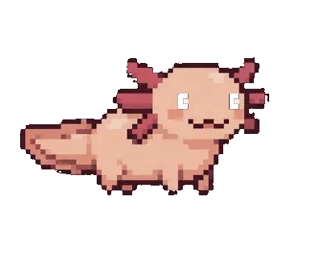

<div align="center">


# PRAXIS

### Your AI never forgets your project.

**Praxis is an open-source, local memory for Claude Code.** It distills every coding
session into one durable markdown file — the decisions, the constraints, the reasons —
and hands it back to Claude automatically the next time you open the project.

[](https://www.npmjs.com/package/praxis-memory)
[](LICENSE)
[](https://nodejs.org)
[](#safety)

```bash
npx praxis-memory
```

*One command — same on **Windows, macOS and Linux** (Node 18+). It sets up the hooks, the memory file, everything — then every session after remembers.*

**Two doors:** before Claude, it's the terminal — `npx praxis-memory`. Inside Claude Code, it's the slash — type `/` and the `/praxis-*` commands are right there.

</div>

---

## Why

| **0 bytes** | **$0** | **1 file** | **MIT** |
|:--:|:--:|:--:|:--:|
| leave your machine | added inference cost | portable markdown | open source |

Every new Claude Code session starts from zero. You re-explain the stack, it re-explores
yesterday's dead ends, and it "simplifies" the one file that must never be touched.
Praxis closes the loop: the context survives the session.

## How it works

```
   session ends
       │
       ▼
   Claude Code "Stop" hook ──▶ praxis capture
       │                          │
       │                          ▼
       │                  .praxis/memory.md   (redacted, size-capped)
       ▼
   next session starts
       │
       ▼
   CLAUDE.md ──@include──▶ .praxis/memory.md ──▶ Claude already knows your project
```

- **Auto-load** — `init` adds a managed block to `CLAUDE.md` that `@`-includes your
  memory. Claude reads `CLAUDE.md` automatically, so memory loads every session with
  zero manual steps.
- **Auto-capture** — `init` installs a `Stop` hook. When a session ends,
  `praxis capture` appends a lightweight summary.
- **Rich capture** — `/praxis-save` asks Claude to write a real decision-level summary.

## The companion

<div align="center">

</div>

An axolotl regrows lost limbs; Praxis regrows lost context. The mascot is the status
bar — its state *is* your session's state:

| 🟢 idle | 🟠 warning | 🔴 limit | 🔵 switching | 🟡 restored |
|:--:|:--:|:--:|:--:|:--:|
| context fresh | filling up | limit reached | moving context | context recovered |

Today it lives in the CLI — `praxis status` — with a desktop tray build next on the roadmap.

## Commands

```bash
npx praxis-memory    # set up here (or show status, if already set up)
praxis init          # explicit setup
praxis status        # what Praxis remembers, and session health
praxis feedback      # the two questions that shape what gets built next
```

Inside Claude Code, type `/` and the Praxis commands appear:

| Command | What it does |
|---------|--------------|
| `/praxis-recap` | catch me up on this project |
| `/praxis-save` | rich session summary, written by Claude |
| `/praxis-remember` | save a fact or decision right now |
| `/praxis-forget` | remove outdated info from memory |
| `/praxis-status` | memory at a glance |

## What Praxis writes, and where

| Path | What |
|------|------|
| `.praxis/memory.md` | Your living project memory — the thing Claude reads |
| `.praxis/config.json` | Local settings: capture on/off, size cap, redaction |
| `CLAUDE.md` | A managed `PRAXIS:START/END` block. **Your own content is never touched.** |
| `.claude/settings.json` | A `Stop` hook, merged in without disturbing existing hooks |
| `.claude/commands/` | The five `/praxis-*` slash commands, project-scoped |
| `~/.claude/commands/` | The same five, user-wide — so `/` shows them in **every** project |

> `/` menu looks empty? Restart the open Claude Code session — it loads commands at start.

## Safety

- **Redaction** — before writing, Praxis strips common secrets (API keys, tokens,
  private keys). Best-effort, not a guarantee; the real defense is that Praxis is told
  never to write secrets.
- **Never auto-commits** — `init` adds `.praxis/` to `.gitignore` by default. Commit
  the memory deliberately if you want shared team context.
- **Local only** — v0.1 makes zero network calls.

## Roadmap

- **v0.1 (now)** — local memory for Claude Code: capture loop, `/praxis-save`, `praxis status`.
- **v0.2** — the desktop tray companion, and an MCP server (queryable memory).
- **Later** — cross-tool support, richer summarization.

## Develop

```bash
git clone https://github.com/vaishak-v-nair/PRAXIS.git && cd PRAXIS
npm link          # puts `praxis` on your PATH (needed for the auto-hook)
npm test          # node --test
```

## License

MIT — [LICENSE](LICENSE).

<div align="center">
<sub>🦎 regenerate lost context.</sub>
</div>
