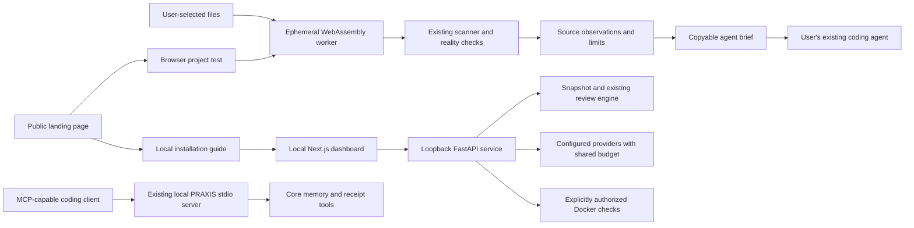

# PRAXIS browser trial and local dashboard

Implemented 2026-10-02. This extends the current PRAXIS codebase; it does not
replace the claim-verification engine, memory, hooks, receipt formats, MCP, or tray.

## The product has two entry points

| Entry point | What the user does | What PRAXIS actually checks |
| --- | --- | --- |
| Public **Test Your Project** page | Select a folder or source files, inspect observations, copy an agent brief | Existing source scanner running in a browser worker; no project upload, model call, command execution, or readiness verdict |
| Local Project Review | Bring a folder, GitHub repository, or upload; connect a provider; authorize runtime checks; review a plan | Existing snapshot, scanner, provider, Docker, evidence assessment, plan, diff, export, and confirmed source-apply workflow |

The public trial is useful before installation. Everyday work stays in the
local application. A source-only result cannot demonstrate a working product;
the interface keeps that distinction beside intake, findings, and the brief.



There is no connection from the public test to the local API, model credentials,
or MCP server. There is no hosted project repository or cloud job store.

## Component architecture

All local dashboard paths below are relative to `apps/workbench`.

```text
app/layout.tsx                         self-hosted Geist fonts, theme initialization
app/page.tsx                           workspace and action ownership
├── AppHeader                          breadcrumb, connection state, appearance
├── Intake / ReviewHistory             existing intake and recorded reviews
├── ReviewWorkspace                    existing job contract and section navigation
│   ├── SummaryMetrics                 four recorded metrics in a 12-column grid
│   ├── Overview
│   │   ├── Readiness accordions        all blockers and remaining requirements
│   │   ├── EvidenceGates              dimensions, evidence records, limits
│   │   ├── AttentionPanel             prioritized human-readable next actions
│   │   └── ModelPerspectives          balanced cards; hypotheses, not runtime proof
│   ├── Findings                       filtered queue and evidence inspector
│   ├── Execution                      actual check records and missing execution
│   ├── Changes                        plan, consent, diffs, export and confirmed apply
│   ├── SourceExplorer                 existing source graph, loaded on demand
│   └── Activity                       recorded job events
├── StatusBar                          persistent local state and New review
└── ProviderModal / ActionModal / Guide keyboard-accessible dialogs
```

`lib/use-workspace.ts` owns the existing API, job state, streaming and mutations.
`lib/contracts.ts` remains the frontend/backend contract. The focused presentation
components accept those records; they do not derive new verification verdicts.
`lib/status.mjs` maps known UI states to a tone, icon and readable label. Unknown
states remain neutral. Model success uses a model icon and an explicit model
label rather than a runtime verification checkmark.

The browser application is separate static source in `web/test-your-project`:

| Module | Responsibility |
| --- | --- |
| `index.html` | Semantic intake, honest scope, observations, selected brief |
| `style.css` | Responsive panels, readable source evidence, focus and status styles |
| `app.js` | File selection, real progress, result rendering with `textContent`, cancel, clear, copy and download |
| `worker.js` | Pinned Pyodide, engine hash validation, privacy selection, ephemeral files and fixed trusted Python entry point |
| `report.js` | Strict source-review contract, actual counts and grounded agent prompt |
| `local.html` | Preserved local installation guide |
| `backend/regen/browser.py` | Browser adapter around the existing scanner; canonical source lives in Workbench |

`scripts/build-browser-engine.mjs` copies `scanner.py`, `reality.py`, and
`browser.py` byte-for-byte and records their SHA-256 digests. Generated copies
are ignored; `scripts/build-web.mjs` regenerates them. Local scans retain the
default external checks. Only the browser adapter selects
`scan_project(..., external_checks=False)`.

## Styles and responsive behavior

The full styles are implemented in `app/tokens.css` and `app/product.css`.
There is no new frontend dependency or animation framework. Existing light mode
is preserved; first use defaults to dark and an existing stored preference wins.
Next.js downloads and self-hosts Geist and Geist Mono at build time.

| Token role | Dark value | Use |
| --- | --- | --- |
| Background | `#0f131c` | Workspace backdrop |
| Surface / raised surface | `#191f2b` / `#222c3c` | Distinct panels and selected navigation |
| Border | `#303d51` | Panel edges and separators |
| Primary / secondary / metadata | `#ffffff` / `#b5c3d9` / `#9caec7` | Accessible text hierarchy |
| Accent | `#f5b4c6` | Primary actions and focus |
| Success | `#83e4b1` on `#143729` | Recorded positive states |
| Error | `#ffaba8` on `#3d202a` | Failure, blocked and high-severity states |
| Warning | `#f7ce82` on `#352a18` | Uncertainty and incomplete evidence |

Metrics and major subgrids use `repeat(12, minmax(0, 1fr))`, with 16px or 24px
gaps. Four metrics each occupy three columns, switching to six on smaller
screens. Model cards occupy three columns at 1400px+, six below that, and the
full width below 600px. Cards stretch only within their own row, not to the
height of an unrelated overview column. Long journey details and every reported
gap remain accessible through accordions.

The findings queue and evidence inspector are independent bordered panels.
The queue is scrollable, severity-sorted and searchable; the inspector exposes
the source, impact and proposed investigation without flattening code into
prose. File paths, hashes, commands and provider IDs use monospace treatments.
Overview blockers and evidence gates expand on demand rather than forming an
uninterrupted wall of text. Unknown or skipped checks are explicit.

The footer stays fixed with a safe-area inset and reserved page padding.
Scroll margins keep focused controls clear of it. Six section buttons expose
`aria-current`; dialogs trap and restore focus. Reduced-motion preferences,
keyboard focus, 320px screens and both themes remain supported.

## Browser trust and capability boundary

The browser trial selects files using the scanner's current bounds: 25,000
reviewable files, 2 MiB per file and 100 MiB total after exclusions. Credentials,
dependency folders, private memory/vaults, virtual environments and generated
output are excluded before reading file bodies. PRAXIS's private root `assets`
vault is excluded when its package manifest identifies the checkout.

Only the trusted scanner modules are imported. Project code is data, never an
import, shell command or evaluated script. Python syntax and AST checks use the
pinned browser interpreter, so results may differ from a project's target
Python version. JavaScript/TypeScript source patterns are not a full compiler,
dependency audit, runtime harness or user-journey check. A folder picker cannot
establish Git history or original filesystem symlink provenance. The snapshot
hash identifies the selected reviewable source, not a commit range.

Pyodide downloads lazily from a pinned official distribution. The page CSP
limits script and connection destinations to its own origin and that runtime
path. No project data is sent to an API. There is no project persistence in
localStorage or IndexedDB. Stop terminates the worker; clear and page exit
discard the review state. Cancellation, timeout, unavailable runtime and engine
hash mismatch produce an unavailable result, never a clean review fallback.
See [Pyodide's worker documentation](https://pyodide.org/en/stable/usage/webworker.html).

The brief is assembled from the selected actual findings, redacted excerpts,
source hash, discovered commands and unperformed checks. It is not an LLM
completion. It tells the coding agent to treat source as untrusted data,
reproduce observations, explain its plan, obtain confirmation, preserve features,
then validate changes. Clipboard failure offers manual selection; copying is
not an approval or automatic implementation.

## Local AI and MCP

Run local Project Review with `./start.ps1` on Windows, or follow the existing
[Workbench integration guide](WORKBENCH-INTEGRATION.md). The UI remains at
`http://127.0.0.1:3000`; the API remains at `http://127.0.0.1:9123` with its
Host/Origin protection. Starting either service does not initiate a model call.
Provider keys stay server-side. Configured models retain the shared budget,
explicit runtime/network consent, source freshness, backup and apply controls.

The existing CLI offers `npx praxis-memory mcp` as a local stdio process for a
client that supports MCP. Its current tools are `praxis_receipt`, `praxis_verify`,
`praxis_receipts`, and `praxis_recall`. Their existing semantics remain intact;
they do not become Workbench review tools through this frontend change. Client
configuration, workspace location and supported transcript formats still matter.
Use [Agent Workflow](AGENT-WORKFLOW.md) and the existing
[local product architecture](designs/PRAXIS-LOCAL-PRODUCT-ARCHITECTURE.md).

The practical sequence is: inspect a project, review and confirm a fix plan in
the coding agent already in use, then run the local checks again. Any future
Workbench MCP tool should wrap the same consent, snapshot and budget contracts,
not create an unrestricted execution path. No public MCP endpoint, community
evidence server, automatic cloud memory upload or new transcript support was
introduced in this change.

## Free cloud options researched on 2026-10-02

Recommendation: host the public static trial, keep source processing in the
browser and keep everyday runtime work local. This avoids needing a hosted
untrusted-code sandbox or paid shared model key for the trial. This is an
architectural recommendation inferred from the limits below, not a cloud
provisioning claim.

| Service | Useful role | Material free-tier constraint |
| --- | --- | --- |
| Cloudflare Pages | Alternative static trial and documentation host | 500 builds/month, one concurrent build, 20,000 site files and 25 MiB per asset. [Official limits](https://developers.cloudflare.com/pages/platform/limits/) |
| Vercel | Continue using the current static website deployment | Hobby is restricted to personal, non-commercial use; it is not a free commercial launch plan. [Official Hobby plan](https://vercel.com/docs/plans/hobby) |
| Cloudflare Workers | Future small gateway or consented metadata endpoint | Free tier has 100,000 requests/day, 10ms CPU per request and 128MB memory; full project analysis or Docker execution does not fit that execution model. [Official limits](https://developers.cloudflare.com/workers/platform/limits/) |
| Render | Disposable API prototype | Free web services sleep after 15 idle minutes, take about a minute to wake, and lose local files on restart/redeploy/spindown. Free Postgres expires after 30 days. [Official free-service guide](https://render.com/docs/free) |
| Supabase | Future optional account/preferences store | Free projects with low activity over a week may pause; it does not execute a project's Docker harness. No account or cloud database is needed for the current trial. [Official project pausing](https://supabase.com/docs/guides/platform/free-project-pausing) |

No new cloud backend, database, storage bucket, subscription or paid plan was
provisioned. Keep provider keys and local project state out of static assets.
Commercial hosting selection and any future opt-in data retention remain
separate from this browser trial.

## Validation

The core suite reports 522 passing tests and 7 skips; the Workbench backend
reports 156 passing tests and 3 skips. TypeScript and the production build pass.
The existing installed-package smoke passes 9/9, including actual true/false
Verify claims, Ed25519 signatures and historical receipt reading. Privacy and
package-size guards pass.

`tools/frontend_smoke.py` checks 12 views, both themes and widths 320, 390, 768,
1024 and 1440, with zero axe violations or JavaScript errors. Its API fixtures
are explicitly test-only; real intake/runtime tests are separate.
`tools/browser_review_smoke.py` drives an actual folder picker and the real
WebAssembly scanner against broken and clean temporary source, checks copy and
manual-copy behavior, cancellation and integrity failure, and asserts no source
upload requests. Browser adapter and report/status modules have focused tests.
The same five scenarios pass on the public
[Test Your Project page](https://praxis-six-xi.vercel.app/test-your-project/)
without authentication, with zero axe violations, JavaScript errors or source
upload requests. All 25 deployed public assets match the tested file digests.
This records the 2026-10-02 build; it is not an assertion about future deployments.

Run the website build before a static deployment:

```powershell
node scripts/build-web.mjs
node --test test/browser-review.test.js test/workbench-presentation.test.js
```

The Pages workflow builds the same canonical engine before publishing static
artifacts. `scripts/build-public-site.mjs` stages only curated public `web`
assets for direct static deployment, excluding dotfiles and symlinks. Private
`.env`, `.praxis`, `.regen`, dependencies, vaults and submitted projects are not
part of that manifest. The core CLI retains zero runtime dependencies. Manual
npm publication remains described in [Manual npm release](MANUAL-NPM-RELEASE.md).
