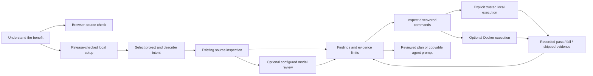

# PRAXIS consumer experience and launch rebuild

2026-10-04. Authorized scope: brainstorm, plan, parallel implementation,
software testing, then a new benefit-led film. Preserve the existing product,
receipts, memory, hooks, providers, budgets and source-apply protections.

## The customer and the job

The user confirmed equal priority for people building products with AI,
developers, and teams. Their shared job is to understand what might fail before
sharing or shipping a project, with a useful handoff to the people and agents
already working on it. This is product direction, not new user research.

The first useful result is a source-backed problem, its practical consequence,
and an inspectable next action. A list of agent frameworks or an installation
success message is not that result. Source inspection, executed tests, observed
user behavior and production readiness remain distinct.

## Brainstorm and convergence

| Approach | Customer effort | Practical limit | Decision |
| --- | --- | --- | --- |
| Source review first | Select a project; no Docker or project-command consent | Cannot establish runtime behavior | Default front door |
| Trusted local tests | Review commands and explicitly authorize this computer | Host files/network remain accessible; a copy is not an OS sandbox | Optional deeper check |
| Docker checks | Install/start Docker and prepare images | Larger setup; some stacks and browser journeys remain unsupported | Retain as optional isolation |
| Substitute Podman | Still needs a machine/VM on Windows and macOS | Moves the prerequisite instead of removing it | Defer |
| OS-specific sandbox | Windows/OS feature setup and separate platform implementations | Not a universal consumer install | Defer |
| Browser execution | Could simplify supported JavaScript projects | Browser/stack/licensing limits; not an arbitrary backend runner | Keep the existing browser source trial; defer a new runtime |
| Signed desktop bundle | Could hide Node/Python setup from consumers | Signing, updates and platform distribution are a separate release project | Future packaging; preserve managed setup now |

The selected architecture combines immediate source inspection, explicit
trusted local checks, and optional Docker. It reuses the existing engine and
managed installer rather than replacing them with another runtime stack.

Official references: [uv managed Python](https://docs.astral.sh/uv/concepts/python-versions/),
[Node permission limitations](https://nodejs.org/api/permissions.html),
[Podman machine](https://docs.podman.io/en/stable/markdown/podman-machine.1.html),
[Windows Sandbox setup](https://learn.microsoft.com/en-us/windows/security/application-security/application-isolation/windows-sandbox/windows-sandbox-install),
[WebContainers](https://webcontainers.io/guides/introduction).
Node permissions and stripped environment variables do not secure malicious code.

## Confirmed starting defects

- The managed review launcher already bootstraps private Python and the optional
  interface. Docker is not required to start it or inspect source.
- Intake always sends `run_checks:true` and requires Docker trust; it conceals
  the existing Docker-free source-review path.
- Initial scan input ignores `runtime_mode:host`; host execution exists only
  in subsequent verification/repair. A local-run option needs schema/dispatcher
  wiring and regression tests.
- The landing page mixes project-review messaging, a memory-only install
  command, system-Python setup, and privacy claims with different scopes.
- npm currently serves 0.14.1. The checkout's 0.14.2 managed review launcher
  remains a manual release candidate. No unpublished consumer command may be
  presented as available.

## Experience and architecture

Default review executes no submitted commands and needs no runtime consent.
Connected model review is optional and sends bounded, redacted excerpts under
the existing shared budget. Missing providers must leave useful source findings
and explicit limits, never fabricated model results. Local execution must be
selected and authorized explicitly; a failed Docker check never falls back to
host execution. Backend defaults remain compatible with existing clients.

Warm paper, ink/slate and peach connect the website, tool and owned mascot.
Semantic blue/emerald/amber/red describe real actions and evidence. Keep dark
appearance, keyboard access, restrained state motion and reduced-motion support.
One clear project/goal/result journey takes precedence over equally prominent
technical panels. Existing advanced functions remain available.

## Ownership and order

1. Runtime agent: backend schema, shared execution dispatch/capabilities,
   runtime provenance and behavior-based tests.
2. Product agent: local intake, execution consent, readable report hierarchy,
   theme/icon/component coherence and UI contract tests.
3. Root: public website/install truth, docs, combined pressure testing and
   full regressions. Shared frontend/backend contracts are coordinated first.
4. Reference agent: inspect both complete supplied films, timestamps and audio
   measurements; derive a distinct storyboard after the product journey works.
5. Film workers: separate authored beats and sound finishing after product QA.
   A fresh independent critic reviews each final encoded cut.

No agent edits another owner's files without an explicit handoff. User-added
`praxis blender.blend`, `praxis/`, private brand masters and prior exports remain
untouched. No credential or private evidence migration, upload or staging.

## Acceptance and software testing

- A missing-Docker machine completes a source review with real findings and no
  project execution. A missing provider is explicit and does not block it.
- Initial scan and subsequent checks honor explicit host/Docker selection;
  invalid selections and untrusted execution are rejected. No silent fallback.
- Deliberately correct and false-success local fixtures produce actual pass/fail
  results, preserve source fingerprints, strip provider secrets, and keep runtime
  provenance and coverage limits.
- Test cancellations, time bounds, stale source, budget protection, failed/skip
  distinctions and unavailable optional browser tooling.
- Run backend regressions, TypeScript, production build, responsive/keyboard/axe
  checks at 320/390/768/1024/1440, core regressions, privacy and tarball gates.
- Validate the packaged launcher without Docker and without a system Python;
  initial dependency download remains explicit and requires Node 22+.
- Public install copy continues to use actual npm availability; publishing is
  manual. Existing memory/tray/receipt commands remain intact.

## New film after the product passes

Keep the accepted 124.7-second walkthrough as depth. Make a separate 48–55-second
launch cut in the existing editable project: problem, project input, one observed
issue, understandable impact, agent handoff and one next action. A persistent
project/finding object connects real recordings and original brand motion.

The Doks.AI reference is 20.067 seconds; LangEase is 33.033 seconds. Their
cause-and-effect object continuity informs the new cut. Exact visual/audio
research remains local; reference footage, layouts, logos and music are not reused.
Use licensed/original music, clean clicks on actual actions, and an intentional
resolved ending. Preserve accepted voice quality; narration changes must serve
the clearer story. Keep a music-only fallback and separate editable audio tracks.

Film gates: native pixels, real results, disclosed fixtures, no overlaps or
decorative status badges, deterministic seeking, readable phone CTA, complete
decode, measured audio levels and independent visual review. Document actual
listening separately. Website/browser trial may be the public CTA while the npm
release is pending; never stage a fabricated public installation.
